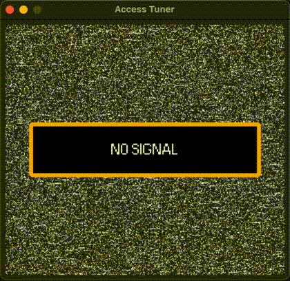

# Alien: Access Tuner 👽 📡

[](https://www.python.org/)
[](https://github.com/astral-sh/uv)
[](https://opensource.org/licenses/MIT)

I've made this litte project from scratch out of love for the Alien franchise.

This project intends to replicate as much as possible the look of the **Access Tuner** from the *Alien: Isolation* game.



## Purpose

I just made this for fun. Perhaps I can put this in a Raspberry Pi and create my own mock physical access tuner. Might look good on a shelf 🤓

## Installation

To install and run this project, you will need to have `uv` installed. Follow the steps below:

1. Clone the repository:

    ```sh
    git clone https://github.com/yourusername/alien-access-tuner.git
    ```

2. Navigate to the project directory:

    ```sh
    cd alien-access-tuner

3. Run the project:

    ```sh
    uv run main.py
    ```

## Functionality

When using the Access Tuner, press the `SPACEBAR` when hovering over the allowed range to move to the next bar until access is "granted".
There is also sound feedback to enhance the experience.

## Effects

### Visual Effects

The Access Tuner features several visual effects to mimic the in-game experience:

- **Screen flicker**: The screen flickers intermittently to simulate an old, malfunctioning device.
- **Static overlay**: A static overlay effect is applied to the screen to give it a more authentic, aged look.
- **Signal interference**: Random signal interference (horizontal) lines appear on the screen.
- **Bloom effect**: Pixels have a bloom glow effect to enhance the visual appeal and replicate old CRT (Cathode Ray Tube) displays.

### Sound Effects

The project includes various sound effects to enhance the immersion:

- **Beep Sounds**: Beep sounds play when pressing the `SPACEBAR`.
- **Access Granted Sound**: A distinct sound plays when access is successfully granted.
- **Error Sound**: An error sound plays if the `SPACEBAR` is pressed outside the allowed range.

## Disclaimer

This project is a fan-made creation and is not affiliated with or endorsed by the creators of the Alien franchise or the game *Alien: Isolation*. All trademarks and copyrights are the property of their respective owners. This project is intended for personal use and educational purposes only.
